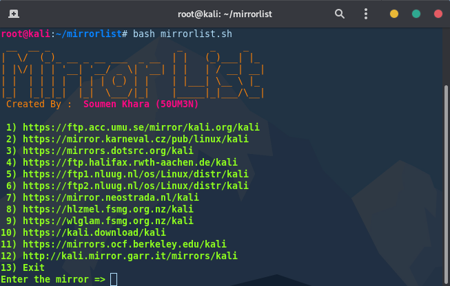

# Mirrorlist
Script to change kali repository mirror

http://http.kali.org redirects you to the closest available mirror based on your physical location.
Most of the time the servers may experience heavy load, thus slowing down upgrades even with fast connection.
Chose your mirror 

You can find the original mirror list here [Kali Mirrors](https://http.kali.org/README.mirrorlist)

# Requirements
Kali Linux,

# Usage
Run the script in privilege mode, such that sources.list could be edited

    # bash mirrorlist.sh

 
